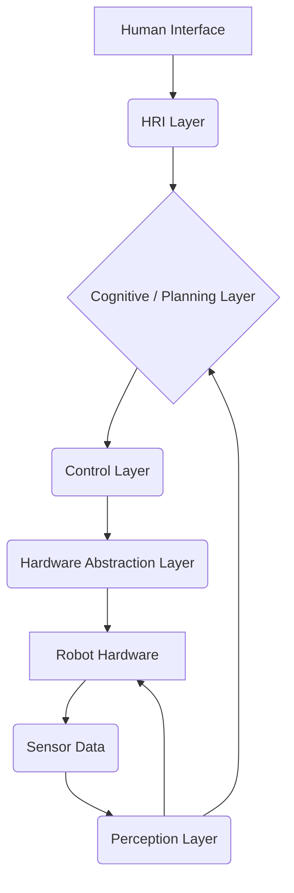

# Capstone Project Architecture

A humanoid robotics capstone project typically integrates various components from perception, control, planning, and human-robot interaction into a cohesive system. This section outlines a generalized architectural overview, emphasizing modularity and ROS 2 integration.

## Layered Architecture

A common approach for complex robot systems is a layered architecture, allowing for separation of concerns and easier development/debugging.

1.  **Hardware Abstraction Layer (HAL)**:
    *   **Purpose**: Interfaces directly with the robot's physical hardware (motors, sensors).
    *   **Components**: Low-level motor controllers, sensor drivers (IMU, joint encoders, force sensors).
    *   **ROS 2 Integration**: Often exposed via `ros2_control` hardware interfaces and ROS 2 topics for raw sensor data.

2.  **Perception Layer**:
    *   **Purpose**: Processes raw sensor data to build an understanding of the robot's environment and its own state.
    *   **Components**: Computer Vision (object detection, pose estimation, segmentation), SLAM (localization and mapping), sensor fusion.
    *   **ROS 2 Integration**: Publishes processed data (e.g., object poses, semantic maps, robot pose) to ROS 2 topics. Leverages Isaac ROS for acceleration.

3.  **Cognitive / Planning Layer**:
    *   **Purpose**: Makes high-level decisions, plans actions, and manages task execution.
    *   **Components**: Behavior Trees, State Machines, LLM Cognitive Planner (for natural language commands), Task Planner (e.g., Nav2 for navigation, specialized planners for manipulation).
    *   **ROS 2 Integration**: Interacts with lower layers via ROS 2 actions and services (e.g., Nav2 action server, custom manipulation action servers).

4.  **Control Layer**:
    *   **Purpose**: Executes planned actions by generating low-level joint commands, ensuring stable and safe robot movement.
    *   **Components**: Inverse Kinematics (IK) solvers, whole-body controllers (for balance and posture), joint trajectory controllers.
    *   **ROS 2 Integration**: Subscribes to high-level commands (e.g., target poses) and publishes joint commands to `ros2_control`.

5.  **Human-Robot Interaction (HRI) Layer**:
    *   **Purpose**: Manages communication and interaction with human users.
    *   **Components**: Speech-to-Text (Whisper), Natural Language Understanding, Text-to-Speech, graphical user interfaces (GUIs), haptic feedback.
    *   **ROS 2 Integration**: Publishes voice commands to the Planning Layer, subscribes to robot status feedback.

## Example: Integrated Architecture Diagram

## Key Architectural Considerations

*   **Modularity**: Design each component as an independent ROS 2 node or package, promoting reusability and maintainability.
*   **Scalability**: Ensure the architecture can handle increasing complexity and sensor data rates.
*   **Real-time Performance**: Critical for humanoid balance and interaction; consider `realtime_safe_controllers` and appropriate QoS settings.
*   **Error Handling and Recovery**: Implement robust mechanisms for detecting and recovering from failures at all layers.
*   **Safety**: Incorporate safety features and protocols at every stage, from hardware E-stops to safe planning algorithms.
*   **Data Flow**: Clearly define message types and topics for inter-node communication.

A well-designed architecture is the backbone of a successful capstone project, allowing for systematic development and integration of complex humanoid robotics functionalities.
